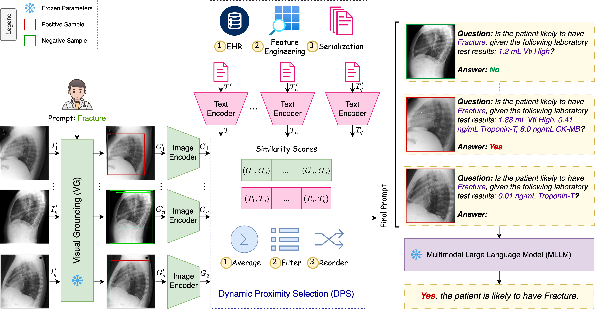

[](https://paperswithcode.com/sota/x-ray-visual-question-answering-on-mimic-cxr?p=medpromptx-grounded-multimodal-prompting-for)
# MedPromptX: Grounded Multimodal Prompting for Chest X-ray Diagnosis
Mai A. Shaaban, Adnan Khan, Mohammad Yaqub [](https://orcid.org/0000-0001-6896-1105)

 **Mohamed bin Zayed University of Artificial Intelligence, Abu Dhabi, UAE**

 **School of Computer Science, Carleton University, Ottawa, CA**

[](https://arxiv.org/abs/2403.15585)
[](https://www.python.org)
[](https://pytorch.org)

<hr>



<hr>

## :bulb: Highlights

* A novel multimodal diagnostic model for chest X-ray images that harnesses multimodal LLMs (MLLMs), few-shot prompting (FP) and visual grounding (VG), enabling more accurate prediction of abnormalities.
* Mitigating of the incompleteness in EHR data by transforming inputs into a textual form, adopting pre-trained MLLMs. 
* Extracting the logical patterns discerned from the few-shot data efficiently by implementing a new dynamic proximity selection technique, which allows for the capture of the underlying semantics.

## :fire: News
- **`2024/03/26`**: Code is released!
- **`2024/05/12`**: The MedPromptX-VQA dataset is released!


## :hammer_and_wrench: Install  

Create environment:  
 ```conda create -n MedPromptX python=3.8```

Install dependencies: (we assume GPU device / cuda available):

```cd env```

```source install.sh```  

Now, you should be all set.

## :arrow_forward: Demo  

1. Go to scripts/   

2. Run:

```python main.py --model Med-Flamingo --prompt_type few-shot --modality multimodal --lang_encoder huggyllama/llama-7b --num_shots 6 --data_path prompts_6_shot --dps_type similarity --dps_modality both --vg True``` 

## :luggage: Checkpoints  

[Med-Flamingo](https://huggingface.co/med-flamingo/med-flamingo)

[OpenFlamingo](https://huggingface.co/openflamingo/OpenFlamingo-3B-vitl-mpt1b)

[LLaMA-7B](https://huggingface.co/huggyllama/llama-7b)


## :black_nib: Citation

If you find our work helpful for your research, please consider citing the following BibTeX entry.   

```bibtex
@article{shaaban2024medpromptx,
      title={MedPromptX: Grounded Multimodal Prompting for Chest X-ray Diagnosis}, 
      author={Mai A. Shaaban and Adnan Khan and Mohammad Yaqub},
      year={2024},
      url={https://arxiv.org/abs/2403.15585},
}
```

## :hearts: Acknowledgement

Our code utilizes the following codebases: [Med-Flamingo](https://github.com/snap-stanford/med-flamingo) and [GroundingDINO](https://github.com/IDEA-Research/GroundingDINO). We express gratitude to the authors for sharing their code and kindly request that you consider citing these works if you use our code.
